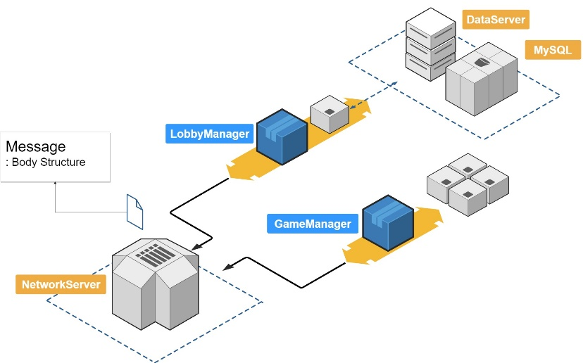
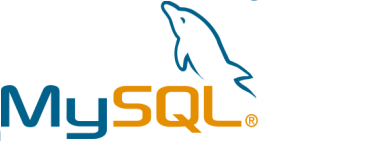

# Server Programming

## Structure




+ NetworkServer : Client와의 UDP 동기화 통신을 담당. Receive된 Body의 MessageHeader를 확인한다.
+ LobbyManager : 현재 Login한 User들을 관리.
+ GameManager : 현재 진행되고 있는 게임의 방을 관리.
+ Database : MySQL Server와의 연동을 담당.

## Libraries

### Boost


Boost provides free peer-reviewed portable C++ source libraries.

We emphasize libraries that work well with the C++ Standard Library. Boost libraries are intended to be widely useful, and usable across a broad spectrum of applications. The Boost license encourages both commercial and non-commercial use.

We aim to establish "existing practice" and provide reference implementations so that Boost libraries are suitable for eventual standardization. Ten Boost libraries are included in the C++ Standards Committee's Library Technical Report (TR1) and in the new C++11 Standard. C++11 also includes several more Boost libraries in addition to those from TR1. More Boost libraries are proposed for standardization in C++17.

https://www.boost.org/

Boost::asio는 동기 모드나 비동기 모드로 사용이 가능하다.

+ 동기(synchronous : 동시에 일어나는)
  + 동기는 말 그대로 동시에 일어난다는 뜻. 요청과 그 결과가 동시에 일어난다는 약속. 바로 요청을 하면 시간이 얼마가 걸리던지 요청한 자리에서 결과가 주어져야 한다.
  + 요청과 결과가 한 자리에서 동시에 일어남
  + A노드와 B노드 사이의 작업 처리 단위(transaction)를 동시에 맞추겠다.

+ 비동기(Asynchronous : 동시에 일어나지 않는)
  + 비동기는 동시에 일어나지 않는다를 의미. 요청과 결과가 동시에 일어나지 않을거라는 약속. 
  + 요청한 그 자리에서 결과가 주어지지 않음
  + 노드 사이의 작업 처리 단위를 동시에 맞추지 않아도 된다.

각각의 장단점으로는, 동기방식은 설계가 매우 간단하고 직관적이지만 결과가 주어질 때까지 아무것도 못하고 대기해야 하는 단점이 있고, 비동기방식은 동기보다 복잡하지만 결과가 주어지는데 시간이 걸리더라도 그 시간 동안 다른 작업을 할 수 있으므로 자원을 효율적으로 사용할 수 있는 장점이 있다.

NetworkListener, LobbyManager는 동기방식으로 설계하였고, GameManager는 자원의 활용을 위해 비동기방식으로 설계하였다.

통신에 사용하게 될 Boost::Array< Body >의 Body에는 MessageHeader가 있다. Server의 NetworkListener는 MessageHeader로 Client의 Request를 분별하여 Client가 원하는 Response를 처리할 Class로 packet을 전달한다.

```c++
enum class MessageHeader
{
    // Sign in, to LobbyManager
    LOGIN_REQUEST       = 1,
    LOGIN_FAIL          = 2,

    // Sign up, to LobbyManager
    REGISTER_USERID     = 3,
    REGISTER_FAIL       = 4,

    // Change Character, to LobbyManager
    CHANGE_STATUS       = 5,

    // Game, to GameManager
    READY               = 6,
    GAME_START          = 7,
    GAME                = 8,
    GAME_END            = 9,
};
```

### MySQL



The MySQL™ software delivers a very fast, multithreaded, multi-user, and robust SQL (Structured Query Language) database server. MySQL Server is intended for mission-critical, heavy-load production systems as well as for embedding into mass-deployed software. Oracle is a registered trademark of Oracle Corporation and/or its affiliates. MySQL is a trademark of Oracle Corporation and/or its affiliates, and shall not be used by Customer without Oracle's express written authorization. Other names may be trademarks of their respective owners.

The MySQL software is Dual Licensed. Users can choose to use the MySQL software as an Open Source product under the terms of the GNU General Public License (http://www.fsf.org/licenses/) or can purchase a standard commercial license from Oracle. See http://www.mysql.com/company/legal/licensing/ for more information on our licensing policies.

https://dev.mysql.com/

유저의 데이터를 저장할 Database는 MySQL로 생성. Body Structure와 동기화가 되도록 하여야하며 테이블은 다음과 같다.


## Execute

```shell
$./bin/main
```
